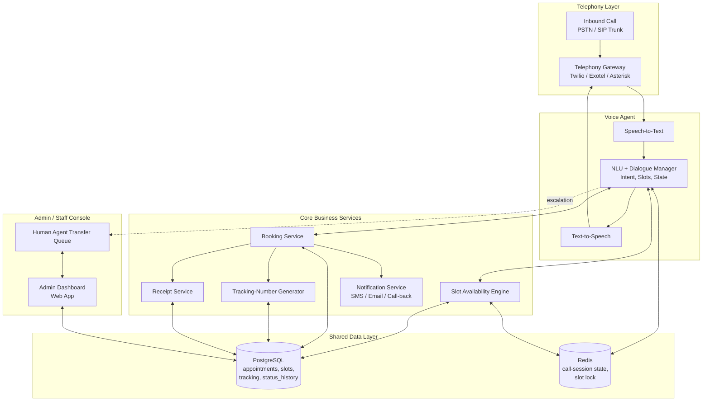
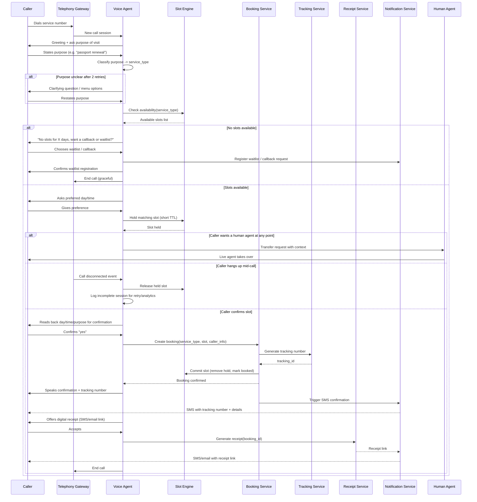
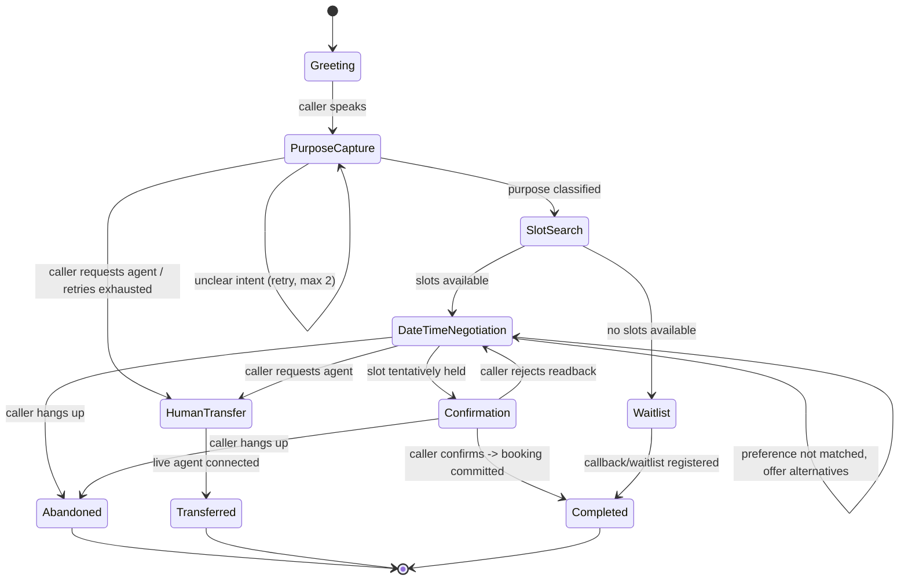

# Smart Appointment Call Agent — Phase 1: System Architecture Overview

## 1. Component Architecture



**Component responsibilities**

| Component | Responsibility |
|---|---|
| Telephony Gateway | Answers PSTN/SIP calls, streams audio to the Voice Agent, plays TTS audio back, handles DTMF fallback |
| Voice Agent (STT→NLU→TTS) | Converts speech to text, classifies intent/purpose, manages dialogue state, generates spoken responses |
| Slot Availability Engine | Queries open slots per service type/location, applies holds during negotiation, releases expired holds |
| Booking Service | Validates and commits a booking, orchestrates tracking number + receipt + notification |
| Tracking-Number Generator | Issues a unique, collision-free tracking/booking ID |
| Receipt Service | Renders a printable/downloadable receipt (PDF/HTML) with purpose, date, time, tracking number |
| Notification Service | Sends SMS/email confirmations and later status-change alerts |
| Admin Console | Staff view of bookings, manual override, human-agent handoff queue, reporting |
| PostgreSQL | System of record: appointments, slots, tracking, status history |
| Redis | Ephemeral call-session state and short-lived slot holds (prevents double-booking during active calls) |

---

## 2. Call Sequence — Happy Path + Error/Fallback Paths



**Key fallback rules**

- **No slots available** → offer waitlist or scheduled callback instead of a dead end; never end the call with silence.
- **Ambiguous purpose** → max 2 clarification attempts, then transfer to a human agent.
- **Explicit "talk to a person"** → immediate transfer with full session context passed to the human agent queue (no re-asking purpose).
- **Mid-call hangup** → any held slot is released via a Redis TTL expiry as a safety net even if the disconnect event is missed; session logged as incomplete for follow-up SMS ("looks like we got disconnected, tap to resume").
- **Slot race condition** (two callers want the same slot) → Redis-based short-TTL hold at negotiation time, final commit re-validated against PostgreSQL before booking is written.

---

## 3. Call Session State Machine



---

## 4. Recommended Service-Oriented Repo Structure

```
smart-appointment-agent/
├── services/
│   ├── telephony-gateway/          # Webhook handlers for telephony provider (Twilio/Exotel/Asterisk)
│   │   ├── src/
│   │   └── README.md
│   ├── voice-agent/                # STT -> NLU/Dialogue Manager -> TTS
│   │   ├── src/
│   │   │   ├── stt/
│   │   │   ├── dialogue/           # state machine + intent classifier
│   │   │   ├── tts/
│   │   │   └── session/            # Redis-backed call session store
│   │   └── README.md
│   ├── slot-engine/                # Availability queries, holds, release-on-expiry
│   │   ├── src/
│   │   └── README.md
│   ├── booking-service/            # Booking orchestration (calls tracking + receipt + notify)
│   │   ├── src/
│   │   └── README.md
│   ├── tracking-service/           # Unique tracking/booking ID generation + status lookups
│   │   ├── src/
│   │   └── README.md
│   ├── receipt-service/            # PDF/HTML receipt rendering
│   │   ├── src/
│   │   └── README.md
│   ├── notification-service/       # SMS/email/call-back dispatch
│   │   ├── src/
│   │   └── README.md
│   └── admin-console/              # Staff dashboard (web app)
│       ├── frontend/
│       └── backend/
├── shared/
│   ├── db/                         # Migrations, schema, seed scripts (PostgreSQL)
│   ├── libs/                       # Shared types, service-catalog config, logging, auth
│   └── infra/                      # Docker, k8s manifests, Terraform
├── docs/
│   └── architecture/               # This blueprint, diagrams, ADRs
├── docker-compose.yml
└── README.md
```

**Notes on the structure**
- Each service is independently deployable, communicates over internal HTTP/gRPC, and owns no private database — all persistent state lives in the shared PostgreSQL instance (per the "Data of Record" principle), with Redis reserved strictly for ephemeral session/hold state.
- `shared/libs/service-catalog` should hold the purpose-of-visit taxonomy (Module 4) as versioned config so new service types (e.g. adding "driving license renewal") don't require code changes to the NLU layer.
- `admin-console/backend` can start as a thin read/write layer over the same Booking/Tracking services rather than duplicating business logic.

---

This covers Module 1 in full: component diagram, end-to-end call sequence with error/fallback paths, the call-session state machine, and the recommended repo layout. Ready to move to Module 2 (Telephony & Call Routing) or Module 3 (Conversational Voice Agent) whenever you want to continue.
